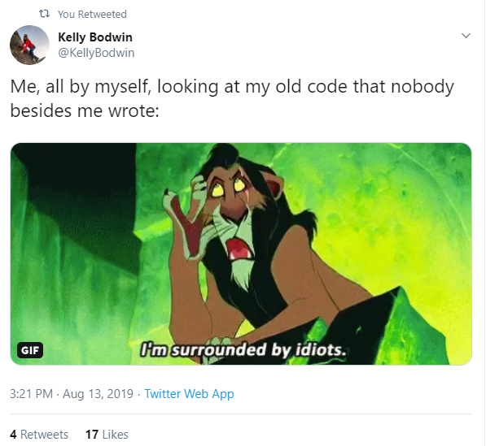
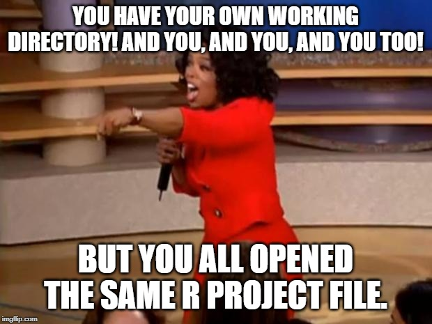

```{r setup, include=FALSE}
options(htmltools.dir.version = FALSE)
library(tidyverse)
```

```{r xaringan-themer, include=FALSE}
library(xaringanthemer)
solarized_light()
```

class: center, middle

### Lots of different backgrounds here!

# Why are you here? Why R? Why now?

---

# Why should you learn R?

* R is free, R improves, R has existed for a long time
* Students can show what they have learned to a potential employer easily
* The support system for R is actually very good!
  * Many free textbooks online
  * Tons of announcements and content on Twitter
  * [StackOverflow](https://stackoverflow.com/) for coding questions
  
.center[]

---

# But why should YOU learn R?

* R and R Markdown will save you TONS of time. Long term thinking is key.

--

  * You can easily tweak your code if you need to do another analysis
  
--

  * Remembering what drop-down menu something is in two years from now in a different program will be hard
  
--

  * Remembering to copy-and-paste your updated plots/analysis into your word processor is a pain and error prone
  
--

.center[*Your closest collaborator is you from six months ago, but you no longer answer emails* - Mark Holder]


```{r, out.width = "35%", echo = FALSE, fig.align='center'}

```
---

# Good Coding Habits


* [Good coding style](https://style.tidyverse.org/) -- Use a consistent style!

--

* Use some form of Git

--

* Take advantage of R Markdown, R Shiny, and R projects where appropriate

--

.center[*Reproducibility is key!*]

---

# What this workshop is

* Some of...

.center[]

* Plus a few others: rmarkdown, shiny, and your advanced topics

---

# Let's Get Started

* [Installing R](https://www.r-project.org/)

  * Follow the "Getting Started" directions to download and install R
  
--

* [Installing RStudio](https://www.rstudio.com/products/rstudio/)

  * Click on "RStudio Desktop" and follow the directions to download and install the **open source edition** of RStudio Desktop
  
---

# Collecting the workshop materials

* Open RStudio

* In the Console pane (bottom left or just left by default) type the following and hit Enter

.center[**install.packages("usethis")**]

* Now, in the same Console pane, type the following and hit Enter

.center[**usethis::use_course("hglanz/rworkshop")**]

* You should see a new RStudio session open and come to the front of your screen except now, in the very top right corner of RStudio, you should see that light blue icon next to **rworkshop**

---

# What did we just do?!

* You installed Base R

* You installed RStudio

* You installed your first package: `usethis`

* You obtained all of our workshop materials (to your Desktop) via some functionality of the `usethis` package

* You opened an R project file called *rworkshop* (more on this later)

* **NOTE**: the `usethis` package is not necessary for work in R/RStudio, but is a very convenient tool for organizing and disseminating materials.

---

# Working with R through RStudio

* R is the language

--

* RStudio is the IDE (integrated development environment) -- not required to work with R, but highly recommended

--

# Basic Ways to Use R

1. In the Console Pane

  * Try `2 + 2` and hit Enter

--

2. In an R script (.R) file

  * File -> New File -> R Script
  
--

  * Type `2 + 2` in your script, select/highlight it, and then hit Ctrl + Enter
  
* You just ran your first line of code!

* Notice that both showed up in your Console pane

---

# Variables and Data Structures

* In the previous slide you just used R like a calculator

* We're going to want to do much more complicated things involving, among other things, datasets

--

* To create our own **stored** data or values, we can do the following:

```{r, output = FALSE}
x <- 5
height <- c(64, 72, 63, 70, 69)
weight <- c(160, 190, 140, 180, 170)
norm_values <- rnorm(10)
```

* Assignment is done via `<-`

* The main data structures in R:

  * Vectors, Matrices, Data Frames, Lists
  
  * Tibbles (Tidyverse)


* We just created 4 vectors of different lengths (notice them in your Environment tab)

---

# Data Structures Continued

* Your use of the aforementioned data structures depends on what your main uses of R will be

* In this workshop we will primarily work with vectors, data frames, and lists (and possibly tibbles)

--

* Notice that when we stored values in variables, they were not printed to the Console 

  * This is usually the case. One way to see the value of a variable is to just type its name into the Console
  
--

* The `norm_values` variable was created using a function: `rnorm()`

```{r}
norm_values
```

---

# Working with Vectors I

* We can reference parts (elements) of a vector using `[]`

```{r}
height[2]

# Multiple elements
weight[c(1, 3, 5)]
1:3
weight[1:3]
```

---

# Working with Vectors II

* Referencing all but certain elements:

```{r}
height
height[-2]
```

* What if we wanted to convert all of our heights to centimeters?

--

```{r}
height*2.54
```

* Vectorization!!!

---

# Vectorization

* MANY functions and operations in R work on vectors in an element-wise fashion:

```{r}
height^2
sqrt(weight)

bmi <- height / (weight^2)
bmi
```

---

# Functions in R

* Most R packages are made up of functions; this is mostly how R functionality has expanded

```{r}
mean(height)
sd(height)
```

* Here we're using the `mean()` and `sd()` functions to comput the mean and standard deviation of the `height` vector

* These functions take multiple inputs, but the main one is a **vector of data**

* To find out more about a particular function use:

```{r, eval = FALSE}
?mean
```

---

# Data Frames

* Let's combine our `height` and `weight` vectors into a **data frame**

```{r}
people <- data.frame(
  heights_in = height,
  weights_lb = weight
)

people
```

---

# Working with Data Frames

* We can reference columns in a data frame using `$`

```{r}
people$heights_in
```

--

* We can also use the `[]` syntax from before (`[row, column]`)

```{r}
people[,1]
```

--

* We can also use the following syntax which mimics lists

```{r}
people[["heights_in"]]
```

---

# Data Frames vs. Lists

* Data frames are very similar to the datasets you know and love

  * Columns of different data types (e.g. numeric, character, etc.)
  
--

* Lists are very robust

  * Elements can be any object type (e.g. vector, matrix, data frame, etc.)
  
  * Can still reference using `$` or `[[]]`
  
  * Output from many complex functions are often in the form of a list

---

# Creating Our Own List

```{r}
mylist <- list(
  x = x,
  myheights = height,
  mypeople = people
)
mylist
```

---

# R Markdown

* File -> New File -> R Markdown

  * "Document" and "HTML" are fine for now, but you can see we have many options for output types
  
--

* This file looks very different!

  * The symbol (at the top of the pane) and file extension are different than an R script

  * There appears to be header information
  
  * There appear to be gray and white chunks throughout the file

---

class: inverse

# Fresh R Markdown Activity

* In your new R Markdown file, do and answer the following with your neighbors:

  * Create a new folder on your desktop called `rworkshop_lastname`

  * Save this R Markdown file to this new folder as `rmarkdownactivity_lastname`. You can use either the File menu or the little save icon at the top of the R Markdown file.
  
  * What do you think the differences are between the white chunks and the gray chunks?
  
  * What happens when you click the green play button on the right side of the second gray chunk from the top? What about for the last gray chunk?
  
  * What happens when you click the "Knit" icon at the top of the R Markdown file? Can you trace all of the things you're seeing produced back to the R Markdown file?
  
  * In the last gray chunk, change `echo = FALSE` to `echo = TRUE` and then click the green play button for that chunk again. What changed? Click the "Knit" icon again and observe the result. What changed?

---

class: inverse

# Fresh R Markdown Activity "Answers"

* Gray chunks contain code that can be run. White chunks contain (markdown) text. The interweaving of these two means that we can create dynamic reports seamlessly in a single location/file!

--

* Each gray chunk can be thought of as a mini R script file. You can highlight only portions of code in a chunk to run via *Ctrl + Enter* or you can run the whole chunk via that green play button. Results appear in-line, i.e. beneath each code chunk.

--

* Knitting an R Markdown file means "running" the code/markdown within and producing the corresponding output file (HTML, PDF, Word). Yours should have produced an HTML file. While the result popped up for you in a separate RStudio window, the resulting HTML file is produced in the same location as your R Markdown file (check your Desktop!).

--

* There are vast number of features and customizability options to take advantage for both the R Markdown and the resulting files (e.g. `echo`)!


---

# RStudio Bells and Whistles

.center[]

--

* Just ask!

---

class: inverse

# Some Toy Work with `iris`

* Canonical `iris` dataset 

```{r, echo = FALSE}
as_tibble(iris) %>%
  head()
```

--

* Make sure you are in the RStudio session associated with the `rworkshop` project (check the upper right)

* Open up the *rworkshop* folder on your desktop

* Navigate to the *day1/1.1-Getting_Started_With_R/Activity* subfolder

* Open up the *toyworkiris.Rmd* file

* Read and work your way through this file (be sure to run all of the code chunks by the end of your work)

---

# `iris` Work Follow-Up

* Amongst other things, you just made some changes to the `iris` dataset and saved them in `myiris`

* The very last code chunk (containing the following) saved your `myiris` dataset to a new file on your computer:

.center[`write_csv(myiris, "myiris.csv")`]

--

* Where did this file get created on your machine? How could we change where the file gets created?

--

* Let's keep things as reproducible as possible!

.center[**R projects**]

---

# R Projects

* Projects for your R work!

* Fantastic organizational tool

--

* Close out of all of your current RStudio sessions

* Open up the `rworkshop` folder on your desktop

* Open the `rworkshop` R project file (light blue square icon with `R` in the middle)

* Locate your working directory path at the top of the Console pane

--

```{r, out.width = "40%", echo = FALSE, fig.align='center'}

```

---

class: inverse

# Fresh R Project Activity

* In RStudio, File -> New Project

  * Select `Existing Directory`
  
  * Browse to your Desktop and select your newly created `rworkshop_lastname` folder
  
  * Click `Create Project`
  
* Start a new R Markdown file and do the following within:
    
  * Create a vector called `myvals` of the values 1-25
  
  * Create a vector called `mylogs` that is the `log` of `myvals`
  
  * Create a variable called `mycv` that is the ratio of the `mean` of `myvals` to the `standard deviation` of `myvals`
  
  * Knit the file
  
* Navigate to your `rworkshop_lastname` folder and confirm that your new R Markdown and resulting HTML file are within along with the project file itself

---

# Short History of R

* An open source implementation of the S programming language combined with a few other things

* Functionality has expanded in an almost explosive way over the last 10-15 years via **packages**

  * This has been both awesome and challenging: new functionality vs. no formal coordination of consistent syntax etc.

* The `ggplot2` package for visualization, created by Hadley Wickham in 2005, is one of the most popular R packages

  * This is now considered part of what's known as **The Tidyverse**
  
* **The Tidyverse** is a colletion of open source R packages introduced by Hadley Wickham and his team that "share an underlying design philosophy, grammar, and data structures" of **tidy data**

  * `ggplot2`, `dplyr`, `tidyr`, `readr`, `purrr`, `tibble`, `stringr`, and `forcats`
  
  * **tidy data**: rows correspond to observations/cases and columns to variables