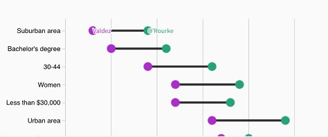

# Tips for Creating Visually Appealing Data Visualizations 

One of my favorite references when I am creating plots are the slides from Will 
Chase's presentation at the 2020 RStudio Conference [(link)](https://www.williamrchase.com/slides/assets/player/KeynoteDHTMLPlayer.html#0). 
Will is a graphic designer and lays out some interesting "best practices" for 
creating graphics that we can explore. His suggestions are for three components 
of the plot: layout, typography, and color. Here are some big take-aways that I 
use when I create a plot!  

- Titles should be top-left aligned (usually). 


- Don't make people tilt their head!


- Don't use borders!


- Remove grids and lighten as much as possible -- don't use minor grid lines. 


- Legends suck, so find clever ways to eliminate them. 




- White space is like garlic; take the amount you think you need and triple it.  


- Fonts matter!  


- Colors are hard, so think about them carefully!  

# Data

```{r setup, include = FALSE}
## load the tidyverse packages
library(tidyverse)

surveys <- read_csv("data/surveys.csv")
```

### Challenge 1

> Use what you just learned to create a plot that depicts how the average weight
> of the different sexes of each species changes through the years. 
> Play around with which variable you facet by versus plot by! 

```{r}
## To get you started:  
yearly_species_weight <- surveys %>% 
  group_by(year, species_id, sex) %>%
  ## Variables to group by!
  summarize(avg_weight = mean(weight))

## Your ggplot() code for the plot goes here!


```


# **`ggplot2`** Themes

Usually plots with white background look more readable when printed. 
Every single component of a `ggplot()` graph can be customized using the generic 
`theme()` function, as we will see below. However, there are pre-loaded themes 
available that change the overall appearance of the graph without much effort. 

For example, we can change our previous graph to have a simpler white background 
using the `theme_bw()` function:

```{r}
yearly_species_weight %>% 
  ggplot(mapping = aes(x = year, y = avg_weight, color = species_id)) +
  facet_wrap(vars(sex)) +
  geom_line() +
  theme_bw()
```

In addition to `theme_bw()`, which changes the plot background to white, 
**`ggplot2`**comes with several other themes which can be useful to quickly 
change the look of your visualization. The complete list of themes is available
at <https://ggplot2.tidyverse.org/reference/ggtheme.html>. `theme_minimal()` and
`theme_light()` are popular, and `theme_void()` can be useful as a starting
point to create a new hand-crafted theme.

The
[ggthemes](https://jrnold.github.io/ggthemes/reference/index.html) package
provides a wide variety of options.
The [**`ggplot2`** extensions website](https://www.ggplot2-exts.org) provides a 
list of packages that extend the capabilities of **`ggplot2`**, including 
additional themes.


### Challenge 2

> Use what you just learned to add the plotting background theme 
> of your choosing to the plot you made in Challenge 1!

```{r}
## Your ggplot() code for the plot goes here!


```

# Customization

Take a look at the [**`ggplot2`** cheat sheet](https://github.com/rstudio/cheatsheets/raw/master/data-visualization-2.1.pdf), 
and think of ways you could improve the plot.

## Plot Labels 

Now, let's change names of axes to something more informative than 'year'
and 'avg_weight' and add a title to the figure. Label customizations are done
using the `labs()` function like so:

```{r}
yearly_species_weight %>% 
  ggplot(mapping = aes(x = year, y = avg_weight, color = species_id)) +
  geom_line() +
  facet_wrap(vars(sex)) +
  theme_bw() +
  labs(title = "Species Weight During the Study",
       x = "Year of Observation",
       y = "Average Weight (gm)",  
       color = "Species") 
```

**Tip: Wrapping Titles**    
Sometimes the titles we wish to have for our plots are longer than the space 
originally allotted. If you create a title and the text is running off the plot
you can add a `\n` inside your title to force a line break 
(`\n` stands for new line).  

## Label & Plot Fonts 

Note that it is also possible to change the fonts of your plots. If you are on
Windows, you may have to install the
[**`extrafont`** package](https://github.com/wch/extrafont), and follow the
instructions included in the README for this package.

In the last plot, the axes have more informative names, but their readability 
can be improved by increasing the font size. This can be done with the generic
`theme()` function. 

```{r, results = "hold"}
yearly_species_weight %>% 
  ggplot(mapping = aes(x = year, y = avg_weight, color = species_id)) +
  geom_line() +
  facet_wrap(vars(sex)) +
  theme_bw() +
  labs(title = "Species Weight During the Study",
       x = "Year of Observation",
       y = "Average Weight (gm)",  
       color = "Species") +
  theme(text = element_text(size = 16))
    ## sets ALL the text on the plot to be size 16
```

**Note:**  
`theme_bw()` is function for a **specific** theme and `theme()` is a
generic function for a **variety** of different themes!  

The label text is better, but all of the text on the plot feels a bit
overwhelming. We can specify the text size for each element of the plot
independently, if we so wish. This would look something like this:  

```{r}
yearly_species_weight %>% 
  ggplot(mapping = aes(x = year, y = avg_weight, color = species_id)) +
  geom_line() +
  facet_wrap(vars(sex)) +
  theme_bw() +
  labs(title = "Species Weight During the Study",
       x = "Year of Observation",
       y = "Average Weight (gm)",  
       color = "Species") +
  theme(axis.text.x = element_text(size = 10), 
        axis.text.y = element_text(size = 12), 
        axis.title.x = element_text(size = 14),
        legend.text = element_text(size = 10),
        legend.title = element_text(size = 12),
        plot.title = element_text(size = 16)) 
```


<!-- TODO: Add barplot with long axis labels -->

You may notice that the values on the x-axis are not properly readable. Let's
swap the orientation of the labels, so the reader doesn't have to tilt their 
head when reading our plot! We can do this by simply swapping the `x` and the 
`y` variables in our `ggplot()` `aes`thetics. 


```{r}
yearly_sex_counts %>% 
  ggplot(mapping = aes(x = year, y = n, color = sex)) +
  geom_line() +
  facet_wrap(vars(species_id)) +
  theme_bw() +
  labs(title = "Observed Genera by \n Year of Observation",
      x = "",
      y = "Number of Rodents", 
      color = "Sex") +
  theme(text = element_text(size = 16)) + 
  coord_flip()
    
```


## Legend Position

By default in `ggplot2` the legend is positioned on the right hand side. 
However, you are able to change the position of the legend to the left hand 
side, the top of the plot, or the bottom of the plot. 

This is done by adding a `legend.position` theme to the plot's `theme()`'s. 

```{r}
yearly_sex_counts %>% 
  ggplot(mapping = aes(x = year, y = n, color = sex)) +
    geom_line() +
    facet_wrap(vars(species_id)) +
    labs(title = "Observed Genera by Year of Observation by",
        x = "",
        y = "Number of Rodents", 
        color = "Sex") +
  theme_bw() +
  theme(axis.text.x = element_text(size = 10), 
        axis.text.y = element_text(size = 12), 
        axis.title.x = element_text(size = 14),
        legend.text = element_text(size = 12),
        legend.title = element_text(size = 14),
        plot.title = element_text(size = 14), 
        legend.position = "top") + 
  coord_flip()
    
```

## Removing Grid Lines 

By default, the background of a `ggplot()` contains both minor and major 
gridlines. These can make the plot look a bit busy and difficult for the reader 
to follow. As you may have guessed, to remove these gridlines, we add another
theme to our plot. 

This looks like this:

```{r}
yearly_sex_counts %>% 
  ggplot(mapping = aes(x = year, y = n, color = sex)) +
  geom_line() +
  facet_wrap(vars(species_id)) +
  labs(title = "Observed Genera by Year of Observation by",
      x = "",
      y = "Number of Rodents", 
      color = "Sex") +
  theme(axis.text.x = element_text(size = 10), 
        axis.text.y = element_text(size = 12), 
        axis.title.x = element_text(size = 14),
        legend.text = element_text(size = 12),
        legend.title = element_text(size = 14),
        plot.title = element_text(size = 14), 
        legend.position = "top", 
        ## New themes for the grid lines
        axis.line = element_line(colour = "black"),
        ## 
        panel.grid.major = element_blank(),
        panel.grid.minor = element_blank(),
        panel.border = element_blank(), 
        panel.background = element_blank()) + 
  coord_flip()
    
```

Let's break these options down!  

- The `axis.line` option declares what color the x- and y-axis lines should be. 
(Change it to a different color, if you don't believe me!)
- The `panel.grid.major` removes the major grid (the one associated with the 
ticks from the x- and y-axis).  
- The `panel.grid.minor` removes the minor grid (the one *between* the x- and 
y-axis ticks).  
- The `panel.border` removes the border around the plot.  
- The `panel.background` performs a similar action to `theme_bw()`, but it keeps 
the border around the facet labels.    


## Changing Colors 

The built in `ggplot()` color scheme may not be what you were looking for, but 
don't worry! There are many other color palettes available to use!  

You can change the colors used by `ggplot()` a few different ways.  

### Manual Specification 

Add the `scale_color_manual()` or `scale_fill_manual()` functions to your 
plot and directly specify the colors you want to use. You can either:  

- defining a vector of colors right there (e.g. `values = c("blue", "black", "red", "green")`)  

- creating a vector of colors and storing it in an object and calling it 
(see below)

```{r}
# A color deficient friendly palette with grey:
cbPalette_grey <- c("#999999", "#E69F00", "#56B4E9", "#009E73", "#F0E442", "#0072B2", "#D55E00", "#CC79A7")

# A color deficient friendly palette with black:
cbPalette_blk <- c("#000000", "#E69F00", "#56B4E9", "#009E73", "#F0E442", "#0072B2", "#D55E00", "#CC79A7")

surveys %>% 
  ggplot(aes(x = species_id, y = hindfoot_length, color = genus)) +
  geom_boxplot() +
  scale_color_manual(values = cbPalette_grey)
```

### Package Specification 

Install a package and use it's available color scales. Popular options 
include:  

- `RColorBrewer`: using `scale_fill_brewer()` or `scale_colour_brewer()` 

- `viridis`: using `scale_colour_viridis_d()` for discrete data, 
`scale_colour_viridis_c()` for continuous data, with an inside 
argument of `option = <COLOR>` for your chosen color scheme  

- `ggsci`: using `scale_color_<PALNAME>()` or `scale_fill_<PALNAME>()`, where
you specify the name of the palette you wish to use (e.g. `scale_color_aaas()`)

### Challenge 9

> With all of this information in hand, please take another five minutes to
> either improve one of the plots generated in this exercise or create a
> beautiful graph of your own. Use the RStudio [**`ggplot2`** cheat sheet](https://github.com/rstudio/cheatsheets/raw/master/data-visualization-2.1.pdf)
> for inspiration. Here are some ideas:
>
> * See if you can change the thickness of the lines.
> * Try using a different color palette 
> * Can you find a way to change the name of the legend? What about its labels?
>   (see http://www.cookbook-r.com/Graphs/Colors_(ggplot2)/).


## Arranging and Exporting Plots

Faceting is a great tool for splitting one plot into multiple plots, but 
sometimes you may want to produce a single figure that contains multiple plots 
using different variables or even different data frames. The **`gridExtra`** 
package allows us to combine separate ggplots into a single figure using 
`grid.arrange()`:

```{r, message = FALSE, fig.width = 10, results = 'hold'}
library(gridExtra)

spp_weight_boxplot <- surveys %>% 
  ggplot(aes(x = genus, y = weight)) +
  geom_violin() +
  geom_jitter(color = "tomato", width = 0.2, alpha = 0.1) + 
  scale_y_log10() +
  ## log (base 10) transforms the y-axis variable
  ## (helps to make the plot less skewed)
  labs(x = "Genus", 
       y = expression(Log[10](Weight))) +
  coord_flip() + 
  theme(axis.text.y = element_text(size = 12), 
        axis.text.x = element_text(size = 12), 
        text = element_text(size = 16))

spp_count_plot <- yearly_counts %>% 
  ggplot(aes(x = year, y = n, color = genus)) +
  geom_line() + 
  labs(x = "Year", y = "Abundance")

grid.arrange(spp_weight_boxplot, spp_count_plot, ncol = 2, widths = c(4, 6))
## nrow and ncol specify how many rows/columns you want the arranged plots to be in
## widths specify what proportion of the overall plotting area each plot takes up
```

In addition to the `ncol` and `nrow` arguments, used to make simple arrangements,
there are tools for [constructing more complex layouts](https://cran.r-project.org/web/packages/gridExtra/vignettes/arrangeGrob.html). 


For more assistance arranging plots with `grid.arrage()`. I find the following 
vignette **very** helpful! 

https://cran.r-project.org/web/packages/egg/vignettes/Ecosystem.html
