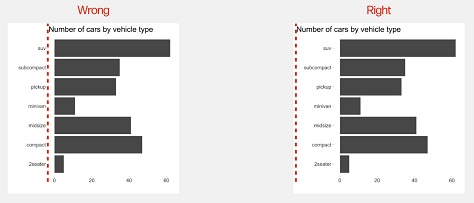
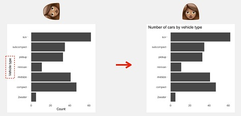
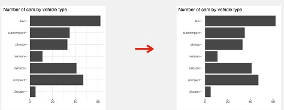
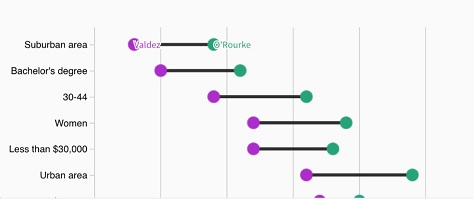
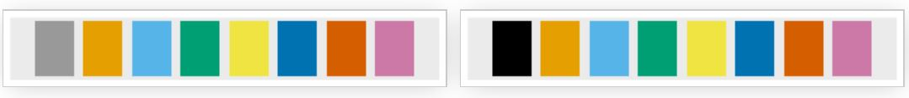

# Tips for Creating Visually Appealing Data Visualizations 

One of my favorite references when I am creating plots are the slides from Will 
Chase's presentation at the 2020 RStudio Conference [(link)](https://www.williamrchase.com/slides/assets/player/KeynoteDHTMLPlayer.html#0). 
Will is a graphic designer and lays out some interesting "best practices" for 
creating graphics that we can explore. His suggestions are for three components 
of the plot: layout, typography, and color. Here are some big take-aways that I 
use when I create a plot!  

- Titles should be top-left aligned (usually). 




- Don't make people tilt their head!




- Remove grids and lighten as much as possible -- don't use minor grid lines. 




- Legends suck, so find clever ways to eliminate them. 




- Fonts matter!  


- White space is like garlic; take the amount you think you need and triple it.  


- Don't use borders!


- Colors are hard, so think about them carefully!  

# Data

```{r setup, include = FALSE}
## load the tidyverse packages
library(tidyverse)
library(forcats)

colleges <- read_csv("data/colleges_clean.csv") %>% 
  mutate(REGION = as_factor(REGION), 
         CONTROL = if_else(CONTROL == 1, "Public", "Private")
         )
```

### Challenge 1

> Use what you just learned to create a plot that depicts the relationship 
> between the average SAT score and the admission rate for public and private 
> colleges in the different regions of the country. 
> Play around with which variable you facet by versus color by! 

```{r}
## Your ggplot() code for the plot goes here!


```


# **`ggplot2`** Themes

Usually plots with white background look more readable when printed. 
Every single component of a `ggplot()` graph can be customized using the generic 
`theme()` function, as we will see below. However, there are pre-loaded themes 
available that change the overall appearance of the graph without much effort. 

For example, we can change our previous graph to have a simpler white background 
using the `theme_bw()` function:

```{r}
colleges %>%  
  ggplot(aes(x = ADM_RATE, y = SAT_AVG, color = CONTROL)) + 
  geom_line() + 
  facet_wrap(vars(REGION)) +
  theme_bw()
```

In addition to `theme_bw()`, which changes the plot background to white, 
**`ggplot2`**comes with several other themes which can be useful to quickly 
change the look of your visualization. The complete list of themes is available
at <https://ggplot2.tidyverse.org/reference/ggtheme.html>. `theme_minimal()` and
`theme_light()` are popular, and `theme_void()` can be useful as a starting
point to create a new hand-crafted theme.

The
[ggthemes](https://jrnold.github.io/ggthemes/reference/index.html) package
provides a wide variety of options.
The [**`ggplot2`** extensions website](https://www.ggplot2-exts.org) provides a 
list of packages that extend the capabilities of **`ggplot2`**, including 
additional themes.


### Challenge 2

> Use what you just learned to add the plotting background theme 
> of your choosing to the plot you made in Challenge 1!

```{r}
## Your ggplot() code for the plot goes here!


```

# Customization

Take a look at the [**`ggplot2`** cheat sheet](https://github.com/rstudio/cheatsheets/raw/master/data-visualization-2.1.pdf), 
and think of ways you could improve the plot.

## Plot Labels 

Now, let's change names of axes to something more informative than 'ADM_RATE'
and 'SAT_AVG' and add a title to the figure. Label customizations are done
using the `labs()` function like so:

```{r}
colleges %>%  
  ggplot(aes(x = ADM_RATE, y = SAT_AVG, color = CONTROL)) + 
  geom_line() + 
  facet_wrap(vars(REGION)) +
  theme_minimal() +
  labs(x = "Admission Rate",
       title = "College Average SAT Scores by Admission Rates",
       y = "",  
       color = "College Type") 
```

**Tip: Wrapping Titles**    
Sometimes authors wish to have titles for their plot, which can be specified 
with the `title` argument to `labs()`. If the the title you wish to have for 
your plot is longer than the space originally allotted for the plot. If you
create a title and the text is running off the plot you can add a `\n` inside
your title to force a line break (`\n` stands for new line).  

## Label & Plot Fonts 

Note that it is also possible to change the fonts of your plots. If you are on
Windows, you may have to install the
[**`extrafont`** package](https://github.com/wch/extrafont), and follow the
instructions included in the README for this package.

In the last plot, the axes have more informative names, but their readability 
can be improved by increasing the font size. This can be done with the generic
`theme()` function. 

```{r, results = 'hold'}
colleges %>%  
  ggplot(aes(x = ADM_RATE, y = SAT_AVG, color = CONTROL)) + 
  geom_line() + 
  facet_wrap(vars(REGION)) +
  theme_minimal() +
  labs(x = "Admission Rate",
       title = "College Average SAT Scores by Admission Rates",
       y = "",  
       color = "College Type") + 
  ## sets ALL the text on the plot to be size 16
  theme(text = element_text(size = 16))
```

**Note:**  
`theme_bw()` is function for a **specific** theme and `theme()` is a
generic function for a **variety** of different themes!  

The label text is better, but all of the text on the plot feels a bit
overwhelming, especially the overlapping text on the x-axis. We can specify the
text size for each element of the plot independently, if we so wish.   

This would look something like this:  

```{r}
colleges %>%  
  ggplot(aes(x = ADM_RATE, y = SAT_AVG, color = CONTROL)) + 
  geom_line() + 
  facet_wrap(vars(REGION)) +
  theme_minimal() +
  labs(x = "Admission Rate",
       title = "College Average SAT Scores by Admission Rates",
       y = "",  
       color = "College Type") + 
  theme(axis.text.x = element_text(size = 10), 
        axis.text.y = element_text(size = 12), 
        axis.title.x = element_text(size = 12),
        legend.text = element_text(size = 10),
        legend.title = element_text(size = 12),
        plot.title = element_text(size = 16)) 
```

You may notice that the values on the x-axis are not properly readable. This 
would be a great location to do some data wrangling to change the format of 
the admission rates. Personally, I would transform the proportion to a
percentage, which would eliminate the extra 0 in the axis text! 

```{r}
colleges %>%  
  mutate(ADM_PERC = ADM_RATE * 100) %>% 
  ggplot(aes(x = ADM_PERC, y = SAT_AVG, color = CONTROL)) + 
  geom_line() + 
  facet_wrap(vars(REGION)) +
  theme_minimal() +
  labs(x = "Admission Rate",
       title = "College Average SAT Scores by Admission Rates",
       y = "",  
       color = "College Type") +
    theme(axis.text.x = element_text(size = 10), 
        axis.text.y = element_text(size = 12), 
        axis.title.x = element_text(size = 12),
        legend.text = element_text(size = 10),
        legend.title = element_text(size = 12),
        plot.title = element_text(size = 16))
```


Unfortunately, there is still some overlapping numbers between the 0% of one 
facet and the 100% of the other facet. We can add some space between the facets
with another `theme()`. The `panel.spacing` argument in `theme()` controls the
spacing between the facets. You specify a `unit()` in `panel.spacing`, which 
states how many lines you want to be between the panels. Currently, there are
about 0.5 lines between the panels. Let's increase the width to 1.25 lines. 


```{r}
colleges %>%  
  mutate(ADM_PERC = ADM_RATE * 100) %>% 
  ggplot(aes(x = ADM_PERC, y = SAT_AVG, color = CONTROL)) + 
  geom_line() + 
  facet_wrap(vars(REGION)) +
  theme_minimal() +
  labs(x = "Admission Rate",
       title = "College Average SAT Scores by Admission Rates",
       y = "",  
       color = "College Type")  +
    theme(axis.text.x = element_text(size = 10), 
        axis.text.y = element_text(size = 12), 
        axis.title.x = element_text(size = 12),
        legend.text = element_text(size = 10),
        legend.title = element_text(size = 12),
        plot.title = element_text(size = 16), 
        # NEW!
        panel.spacing.x = unit(1.25, "lines")) 
```

## Legend Position

By default in `ggplot2` the legend is positioned on the right hand side. 
However, you are able to change the position of the legend to the left hand 
side, the top of the plot, or the bottom of the plot. 

This is done by adding a `legend.position` theme to the plot's `theme()`'s. 

```{r}
colleges %>%  
  mutate(ADM_PERC = ADM_RATE * 100) %>% 
  ggplot(aes(x = ADM_PERC, y = SAT_AVG, color = CONTROL)) + 
  geom_line() + 
  facet_wrap(vars(REGION)) +
  theme_minimal() +
  labs(x = "Admission Rate",
       title = "College Average SAT Scores by Admission Rates",
       y = "",  
       color = "College Type") +
    theme(axis.text.x = element_text(size = 10), 
        axis.text.y = element_text(size = 12), 
        axis.title.x = element_text(size = 8),
        legend.text = element_text(size = 10),
        legend.title = element_text(size = 12),
        plot.title = element_text(size = 16), 
        panel.spacing.x = unit(1.25, "lines"), 
        # NEW! 
        legend.position = "top") 
```

## Removing Grid Lines 

By default, the background of a `ggplot()` contains both minor and major 
gridlines. These can make the plot look a bit busy and difficult for the reader 
to follow. As you may have guessed, to remove the minor gridlines, we add
another theme to our plot. 

This looks like this:

```{r}
colleges %>%  
  mutate(ADM_PERC = ADM_RATE * 100) %>% 
  ggplot(aes(x = ADM_PERC, y = SAT_AVG, color = CONTROL)) + 
  geom_line() + 
  facet_wrap(vars(REGION)) +
  theme_minimal() +
  labs(x = "Admission Rate",
       title = "College Average SAT Scores by Admission Rates",
       y = "",  
       color = "College Type") +
    theme(axis.text.x = element_text(size = 10), 
        axis.text.y = element_text(size = 12), 
        axis.title.x = element_text(size = 8),
        legend.text = element_text(size = 10),
        legend.title = element_text(size = 12),
        plot.title = element_text(size = 16), 
        panel.spacing.x = unit(1.25, "lines"), 
        legend.position = "top",  
        ## New themes for the grid lines
        panel.grid.minor = element_blank(), 
        ## Adds a line at the bottom of the x-axis
        axis.line = element_line(colour = "black"))
```


## Changing Colors 

The built in `ggplot()` color scheme may not be what you were looking for, but 
don't worry! There are many other color palettes available to use!  

You can change the colors used by `ggplot()` a few different ways.  

### Manual Specification 

Add the `scale_color_manual()` or `scale_fill_manual()` functions to your 
plot and directly specify the colors you want to use. You can either:  

- defining a vector of colors right there 
(e.g. `values = c("blue", "black", "red", "green")`)  

- creating a vector of colors and storing it in an object and calling it 
(see below)



```{r}
# A color deficient friendly palette with gray
# Colors specified with hex values (different from RBG)
cbPalette_grey <- c("#999999", "#E69F00", "#56B4E9", "#009E73", "#F0E442",
                    "#0072B2", "#D55E00", "#CC79A7")

# A color deficient friendly palette with black:
cbPalette_blk <- c("#000000", "#E69F00", "#56B4E9", "#009E73", "#F0E442",
                   "#0072B2", "#D55E00", "#CC79A7")

colleges %>%  
  mutate(ADM_PERC = ADM_RATE * 100) %>% 
  ggplot(aes(x = ADM_PERC, y = SAT_AVG, color = CONTROL)) + 
  geom_line() + 
  scale_color_manual(values = cbPalette_grey)
```

### Package Specification 

Install a package and use it's available color scales. Popular options 
include:  

- [`RColorBrewer`](https://www.r-graph-gallery.com/38-rcolorbrewers-palettes.html#:~:text=The%20RColorBrewer%20package%20offers%20several%20color%20palette%20for%20R.&text=There%20are%203%20types%20of,colors%20for%20high%20data%20values): using `scale_fill_brewer()` or `scale_colour_brewer()` 

- [`viridis`](https://cran.r-project.org/web/packages/viridis/vignettes/intro-to-viridis.html):
using `scale_colour_viridis_d()` for discrete data, 
`scale_colour_viridis_c()` for continuous data, with an inside 
argument of `option = <COLOR>` for your chosen color scheme  


### Challenge 3

> With all of this information in hand, please take another five minutes to
> either improve one of the plots generated in this exercise or create a
> beautiful graph of your own. Use the RStudio [**`ggplot2`** cheat sheet](https://github.com/rstudio/cheatsheets/raw/master/data-visualization-2.1.pdf)
> for inspiration. Here are some ideas:
>
> * See if you can change the thickness of the lines.
> * Try using a different color palette 

```{r}

```

