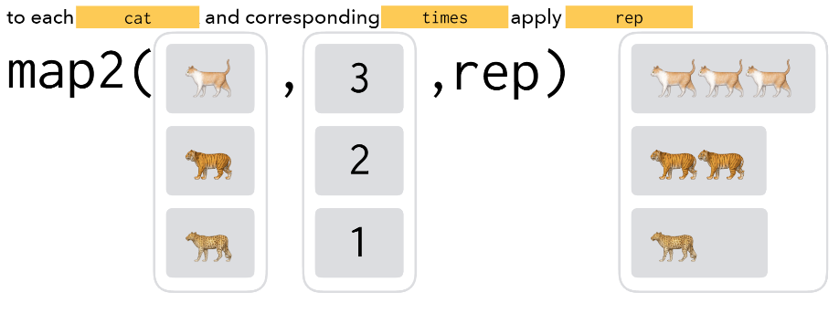

```{r setup, include=FALSE}
options(htmltools.dir.version = FALSE)
library(tidyverse)
```

```{r xaringan-themer, include=FALSE}
library(xaringanthemer)
solarized_light()
```

# Since the Beginning

* Functions allow you to automate common tasks in a more powerful and reproducible way than copy-and-pasting

--

  * Case in point, we've been using functions since Day 1
  
  * Data wrangling, visualizations, summaries...all things we do OFTEN
  
--

* Writing your OWN functions has 3 big advantages over copy-and-paste:

1. You can give a function an informative name that makes your code easier to understand

2. As requirements change, you only need to update code in one place, instead of many

3. You eliminate the chance of making incidental mistakes when you copy and paste

---

# A simple function

```{r}
add_two <- function(x) {
  
  x + 2
  
}

add_two(5)
```

`x` is a placeholder!

---
# Word of Caution 1

Function names are chosen by the writer!

```{r, eval = FALSE}
add_three <- function(x) {
  
  x + 7
  
}

add_three(5)

```

What will this give us?

---

---
# Word of Caution

Unless you are very very experienced, do **not** reference outside objects!

```{r, error = TRUE}
add_two <- function() {
  
  x + 2
  
}

add_two()

x <- 10

add_two()
```


---

# Your turn

Write a function called `times_seven()` which takes a single argument and multiplies by 7.


---

# When should you write a function?

* Consider writing a function whenever you've copied and pasted a block of code more than twice

--

* Consider the following bit of code. What does it do?

```{r}
myiris <- iris

myiris$Sepal.Length <- (myiris$Sepal.Length - mean(myiris$Sepal.Length)) / sd(myiris$Sepal.Length)
myiris$Sepal.Width <- (myiris$Sepal.Width - mean(myiris$Sepal.Length)) / sd(myiris$Sepal.Width)
myiris$Petal.Length <- (myiris$Petal.Length - mean(myiris$Petal.Length)) / sd(myiris$Petal.Length)
myiris$Petal.Width <- (myiris$Petal.Width - mean(myiris$Petal.Width)) / sd(myiris$Petal.Width)
```

--

* That's right, this code standardizes each of the variables in `myiris` to have mean 0 and standard deviation 1

--

* ...or does it?

---

# Let's Make This a Function

* Three key steps to creating a function:

1. Pick a **name** for the function: informative and usually a **verb**

2. List the inputs, or **arguments**, of the function inside `function()`

3. Place the code we've developed in the **body** of the function, a `{` block following `function()`

--

```{r, eval = FALSE}
standardize <- function(data) {
  (data - mean(data)) / sd(data)
}

# OR

standardize <- function(data) {
  newdata <- (data - mean(data)) / sd(data)
  return(newdata)
}

standardize(myiris$Sepal.Length)
```

---

# Intermediate Steps - Function Building Blocks


* Functions can get complex quickly

* It's often a good idea to pull out intermediate calculations into named variables to increase clarity

```{r}
standardize <- function(data) {
  deviations <- data - mean(data)
  newdata <- deviations / sd(data)
  return(newdata)
}
```

---

# Pump The Breaks a Bit

* As exciting as working in R and writing functions can be, testing is **important**

--

* The `iris` data may have worked just fine, but that's about as clean as data can get

--

```{r}
testdata <- c(2, 4, 3, 9, NA, 4, 6)
standardize(testdata)
```


```{r, out.width = "40%", echo = FALSE, fig.align='center'}
knitr::include_graphics("https://media.giphy.com/media/kwCJA4NGu2PtMzpxGb/giphy.gif")
```

---

## We Only Need to Change the Code in One Place: `standardize()`

```{r}
standardize <- function(data) {
  deviations <- data - mean(data, na.rm = TRUE)
  newdata <- deviations / sd(data, na.rm = TRUE)
  return(newdata)
}

testdata <- c(2, 4, 3, 9, NA, 4, 6)
standardize(testdata)
```
  
* Much better!

---

# Some of you may be thinking...

```{r, out.width = "40%", echo = FALSE, fig.align='center'}
knitr::include_graphics("https://media.giphy.com/media/xT77XTpyEzJ4OJO06c/giphy.gif")
```

* We haven't eliminated copy-and-pasting from our `iris` example, right?

--

```{r, eval = FALSE}
myiris$Sepal.Length <- standardize(myiris$Sepal.Length)
myiris$Sepal.Width <- standardize(myiris$Sepal.Width)
myiris$Petal.Length <- standardize(myiris$Petal.Length)
myiris$Petal.Width <- standardize(myiris$Petal.Width)
```


---

## The Second Big Way to Reduce Code Replication: `iteration`

* Essentially, we want to perform a task of the form

.center[**for each `blank` do `blank`**]

--

* If you're familiar with other programming languages, `loops` are probably coming to mind

--

  * R has `for` loops as well
  
```{r, eval = FALSE}
for (i in sequence) {
  ## body code
}
```

---

# Standardize Each Numeric Column of `myiris`

```{r, echo = FALSE}
myiris <- iris
```

```{r}
myiris %>%
  head(2)

for (i in 1:4) {
  myiris[[i]] <- standardize(myiris[[i]])
}

myiris %>%
  head(2)
```

---

class: inverse

# Function & Loop Activity

* Review the following code to understand what it's doing:

```{r, eval = FALSE}
num_high_outliers <- rep(0, times = 4)

num_high_outliers[1] <- sum(myiris$Sepal.Length > quantile(myiris$Sepal.Length, probs = .75) + 1.5*IQR(myiris$Sepal.Length))
num_high_outliers[2] <- sum(myiris$Sepal.Width > quantile(myiris$Sepal.Width, probs = .75) + 1.5*IQR(myiris$Sepal.Width))
num_high_outliers[3] <- sum(myiris$Petal.Length > quantile(myiris$Petal.Length, probs = .75) + 1.5*IQR(myiris$Petal.Length))
num_high_outliers[4] <- sum(myiris$Petal.Width > quantile(myiris$Petal.Width, probs = .75) + 1.5*IQR(myiris$Petal.Width))
```

* Write a `function` and a `for` loop to perform the same task using less replicated code

---

```{r, out.width = "80%", echo = FALSE, fig.align='center'}
knitr::include_graphics("https://i.imgflip.com/384y9m.jpg")
```

--

* Probably don't want one function, `do_all_the_stuff()`....but you could

* Consider also `source("TypicalAnalysis.R")`

---

# An Aside on Scope

* What color will the points on the plot be?

```{r, eval = FALSE}
mycolor <- "red"

myplot <- function(mycolor = "purple") {
  mycolor <- "green"
  myiris %>%
    ggplot(aes(x = Sepal.Length, y = Sepal.Width)) +
    geom_point(color = mycolor)
}

myplot(mycolor = "goldenrod")
```

---

# Code Alternatives to Loops

* Loops can be part of the code you want to replicate

* You could want/need multiple, nested loops

```{r, eval = FALSE}
for (i in sequencei) {
  #body1
  for (j in sequencej) {
    #body2
  }
}
```

--

* The need to iterate still exists, but simplified/cleaner code would be preferable: `purrr` package

---

# The `purrr` package

* Tons of functions for *mapping* functions to the elements/pieces of another object, i.e. iterate over that object

* Our previous example using `purrr`:

```{r, eval = FALSE}
library(purrr)
myiris <- myiris %>%
  select(-Species) %>%
  map(standardize) %>%
```

* `map(.x, .f, ...)`

  * First argument is a vector, list, or data frame
  
  * Second argument is (often) a function
  
  * For each element of `.x` do `.f`
  
---

# Functions and Iteration Recap

* It's good practice to use following recipe for reducing code replication:

  1. Make sure your code works on a single instance (i.e. single column in `iris` dataset)
  
  2. Write your function (or a function) to implement your code with as few **magic** variables/values as possible. Test your function to make sure it works properly.
  
  3. Write your loop or `purrr` code to implement your iteration.
  
---

# Lots of `map`-type Function in `purrr` package

.center[]

* Image credit to Charlotte Wickham

---

class: inverse

# Day 2 Activity

* Locate the `xmas.csv` file in our workshop materials

* Read this file into R

* Use what you've learned today about strings, functions, and iteration with these data to

  * Create 12 character values each representing a verse in the **12 Days of Christmas** song
  
  * The `paste()` function may be useful...
