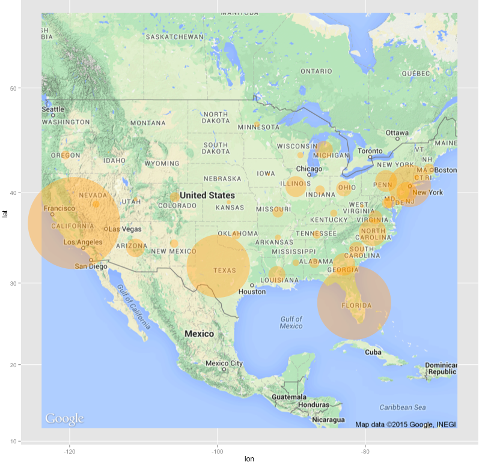

```{r setup, include=FALSE}
options(htmltools.dir.version = FALSE)
library(tidyverse)
```

```{r xaringan-themer, include=FALSE}
library(xaringanthemer)
solarized_light()
```

# Mapping Packages for R

* `maps`

* `ggmap`

* `leaflet`

---

# `maps` package

* Very basic, but very easy

* Primary function: `map()`

  * Plots polygons defined by database which is a collection of polygons
  
  * Surprisingly powerful
  
```{r, eval = FALSE}
library(maps)

map("world")
map("usa")
map("state")
map("county")
```

---

# World Map (`maps`)

```{r, warning=FALSE, message=FALSE, fig.align='center'}
library(maps)
map("world")
```

---

# More Than Just a Plot!

* `map()` function returns important information for customizing the plot

```{r, fig.align='center'}
mapInfo <- map("state", plot = F)
str(mapInfo)
```

---

# Lots of Keywords Available

* `regions=` argument gives you access to much more detail

```{r, fig.align='center'}
# map("state", regions = "california")
map("county", regions = "california,san luis obispo")
```

---

# Easy Data Plotting

* Latitude/Longitude data is immediately plottable

```{r, fig.align='center'}
map("state")
points(us.cities$long, us.cities$lat, pch = 20)
```

---

class: inverse

# `maps` Activity

* Create a map of your home state/country
  
  * Give it the color of your choice

* Open your favorite internet browser and navigate to Google Maps

  * Find your hometown and the corresponding latitude and longitude
  
  * Plot your hometown as a point on your state/country map with the color of your choice

---

# `ggmap` package

* Similar to `ggplot2`, but uses the Google Maps API

  * Unfortunately, the Google Maps API now requires an account and registered API key to use (even though there's still a free usage tier)
  
  * [Getting an API Key](https://developers.google.com/maps/documentation/javascript/get-api-key#restrict_key)
  
---

# My Graduate School!
  
```{r, message = FALSE, fig.align='center'}
library(ggmap)
qmap(location = "boston university")
```

---

# Different View

```{r, message = FALSE, fig.align='center'}
qmap(location = "boston university", zoom = 14)
```

---

# Different Map Type

```{r, message = FALSE, fig.align='center'}
qmap(location = "boston university", maptype = "satellite")
```

---

# Adding Lat/Long Data is Just as Easy

* Take your generated map

* add `+ geom_point()` like you would with a `ggplot` graph

```{r, out.width = "60%", echo = FALSE, fig.align='center'}

```

---

# Interactive Maps with `leaflet`

```{r, fig.align='center'}
library(leaflet)
m <- leaflet() %>%
  addTiles() %>%  # Add default OpenStreetMap map tiles
  addMarkers(lng=174.768, lat=-36.852, popup="The birthplace of R")
m  # Print the map
```

---

# The Data Object

* Both `leaflet()` and the map layer have an optional data parameter that is designed to receive spatial data in one of several forms:
  
* Base R:

  * lat/long matrix
  
  * data frame with lat/long columns
  
* `sp` package

  * SpatialPoints
  
  * Line/Lines
  
  * SpatialLines
  
  * Polygon(s)
  
  * SpatialPolygons

* `maps` package

  * data frame returned from `map()`
    
---

# A `leaflet` Example Using `map()` from `maps` package

```{r, fig.align='center'}
library(maps)
mapStates = map("state", fill = TRUE, plot = FALSE)
leaflet(data = mapStates) %>% addTiles() %>%
  addPolygons(fillColor = topo.colors(10, alpha = NULL), stroke = FALSE)
```

---

# Adding Marker Information

```{r, fig.align='center'}
data(quakes)

# Show first 20 rows from the `quakes` dataset
leaflet(data = quakes[1:20,]) %>% addTiles() %>%
  addMarkers(~long, ~lat, popup = ~as.character(mag), label = ~as.character(mag))
```

---

# Customizing Markers

* [Astronaut Data Exploration](https://mschroth.shinyapps.io/lisinkershinyapp/)

---

class: inverse

# Much More to `leaflet`

* Check out their site for tons of info and examples: [leaflet](https://rstudio.github.io/leaflet/)

# Activity

* Create a `leaflet` state map of the United States with

  * The cities from the `us.cities` dataset from the `maps` package plotted
  
  * With the population information in the marker for each city
  
---

# More Mapping Options

* For shape files: `maptools` package

* For KML files: combination of `rgdal` and `XML` packages

* But you should still be able to use `ggmap` and/or `leaflet` with both of these data types eventually
