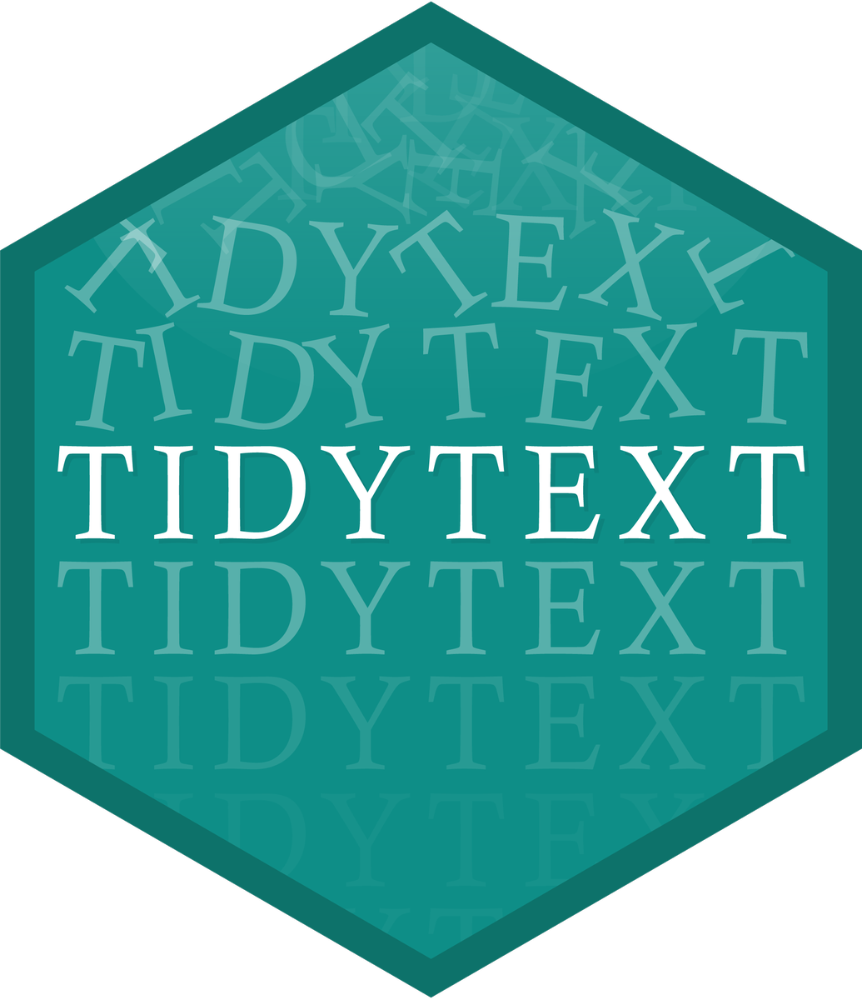

```{r setup, include=FALSE}
options(htmltools.dir.version = FALSE)
library(tidyverse)
library(demoR)
```

```{r xaringan-themer, include=FALSE}
library(xaringanthemer)
solarized_light()
```

---
class: center, middle
# Regular Expressions

---
# Regular Expressions

A **regular expression** is a way of "fuzzy matching" text.

```{r}
my_str <- c("Kelly", "Jelly", "Belly", "Smelly", "Hi Kelly", "Kelly Bodwin")

str_extract(my_str, "Kelly")

str_extract(my_str, ".elly")

str_extract(my_str, "[A-z]+elly")

```

---
# Regular Expressions

* Letters and numbers match themselves

* `.` matches any character at all

* "escape" a special character with `\\` to match the literal character

---
# Regular Expressions

* `^` matches the start of the string

```{r}
str_subset(my_str, "^Kelly")
```

* `$` matches the end of the string

```{r}
str_subset(my_str, "Kelly$")
```

---
# Regular Expressions

* `{2}` means "the thing before me, exactly twice.

* `+` means "the thing before me, 0 to infinity times."

* `*` means "the thing before me, 0 to infinity times."


```{r}
my_str <- c("Key", "Kely", "Kelly", "Kellly", "Kelllllly")

str_subset(my_str, "l{2}")

str_subset(my_str, "l+")

str_subset(my_str, "l*")
```

---

# Regular Expressions

* `[:alpha:]` or `[A-z]` matches any letter
* `[:punct:]` matches any punctuation
* (many more of these - see `stringr` cheatsheet!)
* `()` groups things together
* `[]` is "match any of these"

```{r}
my_str <- c("Kelly", "Kelkel")

str_subset(my_str, "([Kk]el){2}")
```

---
# Quick quiz

What will the following outputs be?

```{r, eval = FALSE}
my_str <- "The Dursleys of Number 4 Privet Drive were 
happy to say that they were perfectly 
normal, thank you very much."

str_extract_all(my_str, ".*")

str_extract_all(my_str, "[:alpha:]+")

str_extract_all(my_str, "[:alpha:]*\\.")

str_extract_all(my_str, "[wv]er[ey]")

str_extract_all(my_str, "[:digit:] ([A-Z][a-z]*)+")
```

Bonus: What is the difference between `str_extract` and `str_extract_all`?

---

# Your Turn

The file `v_orig.txt` contains a monologue from the movie "V for Vendetta".  Read it into R as a string with:

```{r}
vspeech <- readLines("./data/v_orig.txt")
```

Answer the following:

* How many words are in this speech?  (Hint: `str_count`)
* How many words start with the letter "v"?
* How many sentences are in the speech?
* What is the longest word in the speech?
* (challenge) What is the only capitalized word that is not at the beginning of a sentence?

---
class: center, middle

# Tokenizing



---

# Converting text to data

We need to separate text into words and/or n-grams.  These are called **tokens**.

The package `tokenizers` makes this much easier.

```{r}
library(tokenizers)

vspeech %>%
  tokenize_words()
```

---

```{r}
vspeech %>%
  tokenize_ngrams(3)
```

---

# Sentiment analysis

A popular approach to text analysis to to analyze *sentiments*, or how positive/negative certain language is.

```{r}
library(tidytext)

positive <- get_sentiments("bing") %>%
  filter(sentiment == "positive")

positive
```

---
# Sentiment analysis

```{r}
vdf <- vspeech %>%
  tokenize_words() %>%
  data.frame()

names(vdf) <- "word"

```

---
# Sentiment analysis

```{r}
vdf %>%
  semi_join(positive) %>%
  count(word, sort = TRUE)

```

---
# Try it

Find all the *negative* words in V's speech

---

# Word Clouds

```{r, message = FALSE}
library(wordcloud)
```

```
vdf %>%
  count(word) %>%
  with(wordcloud(word, n, max.words = 100))
```

---

# Your Turn

The file `hamlet.txt` contains the entire text of the play "Hamlet".  Try one or two of the following:

* Make a wordcloud
* Determine which characters have the most lines in the play
* Find the most common positive and negative words
* Make a plot of sentiment by Act of the play
* Determine which characters speak most positively or negatively

Helpful links:
* [Regular Expression symbols](https://stat.ethz.ch/R-manual/R-devel/library/base/html/regex.html)
* [tidytext tutorial](https://cran.r-project.org/web/packages/tidytext/vignettes/tidytext.html)
* [stringr + regular expressions](https://stringr.tidyverse.org/articles/regular-expressions.html)
* [a fanastic book on Tidy Text!](https://www.tidytextmining.com/)

