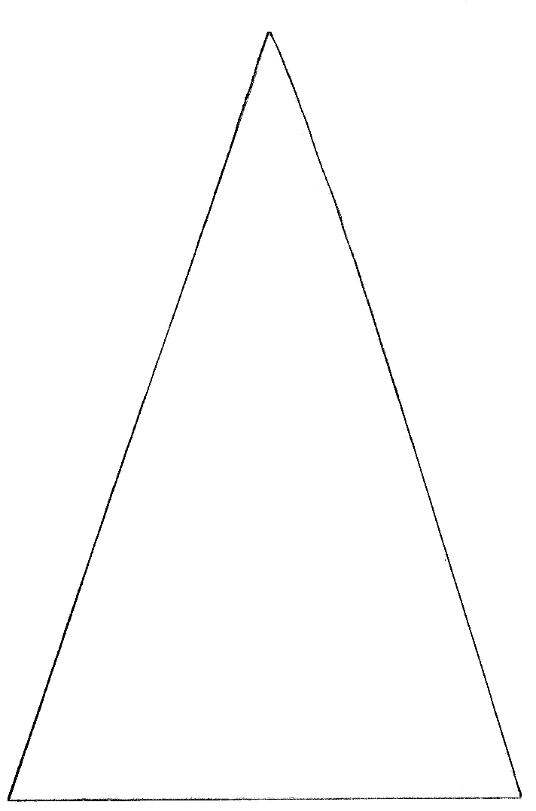
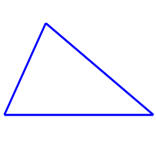
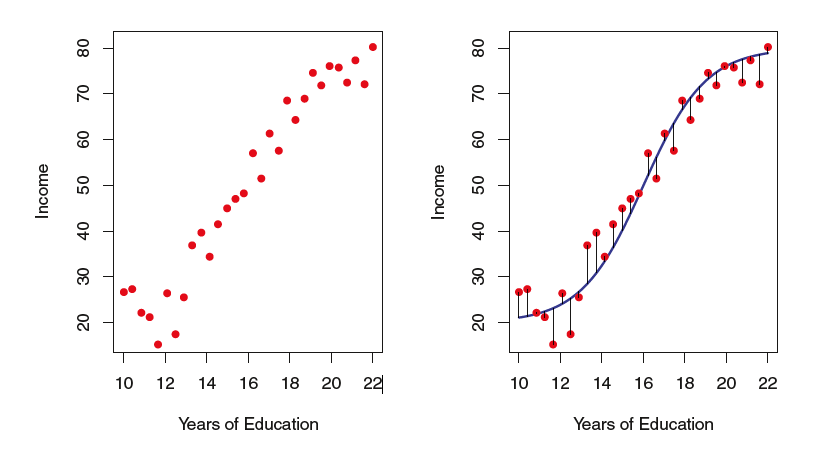
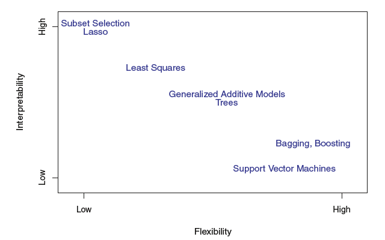
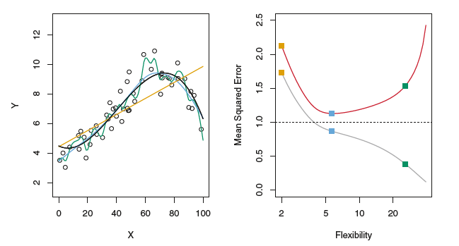

```{r setup, include=FALSE}
options(htmltools.dir.version = FALSE)
library(tidyverse)
```

```{r xaringan-themer, include=FALSE}
library(xaringanthemer)
solarized_light()
```

# Machine Learning Methods (with Associated R Packages)

* Traditional Regression & Logistic Regression (`stats` -- comes with Base R)

  * Simple, Multiple, and Polynomial Regression
  
* Best Subsets and Stepwise Methods (`leaps`)

* LASSO & Ridge Regression (`glmnet`)

* Splines (`splines`)

* General Additive Models (GAMs; `gam`)

* k-Nearest Neighbors (`class`)

* Discriminant Analysis (LDA, QDA; `MASS`)

---

# Machine Learning Methods (with Associated R Packages) Cont'd

* Decision Trees (`tree`)

* Random Forests (`randomForest`)

* Boosting (`gbm`)

* Neural Networks (`neuralnet`, `keras`)

* Support Vector Machines (`e1071`)

* k-Means Clustering (`stats`)

* Hierarchical Clustering (`stats`)

* General Purpose (`caret`, `parsnip`)

---

# Motivation

* One of the most common forms of statistical inference:

--

.center[**Classification**]

--

* The problem of identifying to which of a set of categories a new observation belongs, on the basis of training data.

---

# Think Way Back

```{r, out.width = "40%", echo = FALSE, fig.align='center'}

```

--

* Learning shapes!

```{r, out.width = "30%", echo = FALSE, fig.align='center'}

```
---

# Is It a Triangle?

```{r, out.width = "30%", echo = FALSE, fig.align='center'}

```

```{r, out.width = "30%", echo = FALSE, fig.align='center'}

```

---

# Wait Just a Minute...again

```{r, out.width = "30%", echo = FALSE, fig.align='center'}

```

---

# Could he be...

* waving hello.

--

* waving goodbye.

--

* trying to get our attention (Hey! Look over here)

--

* impersonating someone riding on a parade float.

--

* waiting for a high-five.

--

* trying to hail a cab.

--

* doing something else entirely.

---

# More Examples

* Email spam filters

* Antivirus/Computer Security software

* Speech/text recognition

* Whale species identification from sound

* Image segmentation

---

# The Overall Goal

* In data, characterize the relationship between input and output variables by estimating *f*

$$
Y = f(x) + \epsilon
$$

```{r, out.width = "75%", echo = FALSE, fig.align='center'}

```

---

# In General

* Suppose we observe a response $Y$ and $p$ different predictor variables, $X_1, X_2, \dots, X_p$

  * i.e. we have data on a response/target/output variables and many predictor/explanatory/feature variables
  
* We assume there is some relationship which can be written

$$
Y = f(x) + \epsilon
$$

* where $f$ is unknown and $\epsilon$ is a random error term independent of $X$ with mean 0.

* We want to estimate $f$

---

# Prediction versus Inference

* Prediction is primarily concerned with estimating the output value, $\hat{Y}$, for a given set of inputs

--

* Inference is more concerned with the way(s) that $Y$ is affected as $X_1, \dots, X_p$ change

---

# Why Do We Care About Prediction vs. Inference?

* Why aren't the same models fit no matter which perspective or questions we're coming from?

--

  * Think about regression...
  
  * What's the difference between a model with 1 predictor and a model with 100 predictors?
  
--

```{r, out.width = "60%", echo = FALSE, fig.align='center'}

```

---

# Assessing Model Accuracy

* Once we've decided on research questions and context...

--

  * ...*there is still no free lunch*
  
  * No on method dominates over all others, so we must explore and assess
  
  * Mean Squared Error (MSE):
  
$$
MSE = \frac{1}{n} \sum_{i=1}^n (y_i - \hat{f}(x_i))^2
$$

---

# Where Do We Compute the MSE?

* Do teachers give students the homework questions that you've already done, on exams?!?

--

* Training data vs. Test data
  
  * Training data are the data used to fit the model
  
  * Test data are the separate data used to evaluate the model's performance
  
* We want the method that gives the lowest *test MSE*

---

# Training MSE vs. Test MSE

```{r, out.width = "100%", echo = FALSE, fig.align='center'}

```

---

# Regression-type Problems

* Distinguishable by the *quantitative response variable*

* Possible methods to apply:

--

  * Multiple Regression (including polynomial regression)
  
  * LASSO & Ridge Regression
  
  * Splines
  
  * General Additive Models
  
  * k-Nearest Neighbors
  
  * Decision Trees & Random Forests
  
  * Neural Networks

---

# Classification-type Problems

* Distinguishable by the *categorical response variable*

* Possible methods to apply:

--

  * Logistic Regression
  
  * k-Nearest Neighbors
  
  * Discriminant Analysis
  
  * Decision Trees & Random Forests
  
  * Neural Networks
  
  * Support Vector Machines

---

# Unsupervised Learning

* There is *no response variable*

* Find patterns or groups in the data: **clustering**

* Possible methods to apply:

--

  * k-Means Clustering
  
  * Hierarchical Clustering
  
---

# Regression Example: LadyBugs Data

* In 1983 an article was published about ladybird beetles and their behavior changes under different temperature conditions, in particular how many beetles stayed in light as temperature changed.

```{r, echo = FALSE, message = FALSE, fig.align='center', fig.height = 5}
library(tidyverse)
bugs <- read_csv("../../../data/LadyBugs.csv")
bugs %>%
  ggplot(aes(x = Temp, y = Lighted)) +
  geom_point()
```

---

# Predicting Lighted From Temp (Polynomial Regression)

* Polynomial Regression:

```{r}
train_indices <- sample(1:nrow(bugs), size = floor(.7*nrow(bugs)))
trainbugs <- bugs[train_indices,]
testbugs <- bugs[-train_indices,]
m <- lm(Lighted ~ poly(Temp, 3), data = trainbugs)
m
```

---

# Visualizing The Model

```{r, fig.align='center', fig.height = 4}
fakebugs <- data.frame(Temp = seq(from = -2, to = 35, by = .01))
fakebugs$Pred <- predict(m, newdata = fakebugs)
bugs %>%
  ggplot(aes(x = Temp, y = Lighted)) +
  geom_point() +
  geom_line(data = fakebugs, aes(x = Temp, y = Pred), color = "blue")

```

---
 
# Computing the Test MSE

```{r}
test_preds <- predict(m, newdata = testbugs)
test_mse <- sum((test_preds - testbugs$Lighted)^2)
test_mse
```

---

# Predicting Lighted From Temp (Random Forest)

```{r, message = FALSE}
library(randomForest)
rf <- randomForest(Lighted ~ Temp, data = trainbugs)
rf
```

---

# Visualizing the Models

```{r, fig.align='center', fig.height = 4}
fakebugs$Pred_rf <- predict(rf, newdata = fakebugs)
bugs %>%
  ggplot(aes(x = Temp, y = Lighted)) +
  geom_point() +
  geom_line(data = fakebugs, aes(x = Temp, y = Pred), color = "blue") +
  geom_line(data = fakebugs, aes(x = Temp, y = Pred_rf), color = "red")
```

---

# Test MSE for Random Forest

```{r}
test_preds_rf <- predict(rf, newdata = testbugs)
test_mse_rf <- sum((test_preds_rf - testbugs$Lighted)^2)
test_mse_rf
test_mse
```

---

# Classification Example: Iris Data

* Let's predict `Species` based on the four measurements present in the data

```{r}
train_indices <- sample(1:nrow(iris), size = floor(.7*nrow(iris)))
trainiris <- iris[train_indices,]
testiris <- iris[-train_indices,]
```

---

# Linear Discriminant Analysis (LDA)

```{r, message = FALSE}
library(MASS)
lda_model <- lda(Species ~ Sepal.Length + Sepal.Width + Petal.Length + Petal.Width, data = trainiris)
lda_model
```

---

# Visualize Results & Test Error

```{r}
iris_preds <- predict(lda_model, testiris)
table(iris_preds$class, testiris$Species)
mean(iris_preds$class != testiris$Species)
```

---

# Remember What the Iris Data Looked Like

```{r, fig.align='center', fig.height = 4}
iris %>%
  ggplot(aes(x = Petal.Length, y = Petal.Width, color = Species)) +
  geom_point()
```
